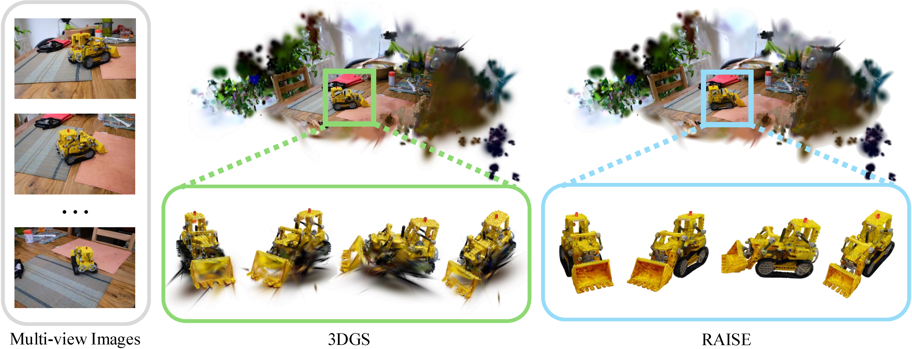

# RAISE: Refine Any Object in Any Scene
[](https://arxiv.org/abs/2506.23835)

RAISE (Refine Any Object In any ScenE) is a 3D enhancement framework that addresses the challenge of missing object viewpoints in scene reconstruction. By leveraging 3D generative priors, RAISE substitutes degraded objects with 3D proxies and progressively refines their geometry and texture via pose alignment and registration-constrained enhancement. This ensures high-fidelity object recovery while preserving scene-level consistency. RAISE outperforms existing methods in novel view synthesis and geometry completion tasks.



## Installation

To set up the environment, you can use the provided `environment.yml` file.
```bash
conda env create -f environment.yml
```
Otherwise, you can manually install the required packages according to `setup.bash`.

Especially for Trellis environment, you can follow the instructions in the [Trellis repository](https://github.com/microsoft/TRELLIS).

## Data Folder Structure

The folder structure for a dataset should be organized as follows:

```
objects_office_d455/
├── depths_cam/             # Contains camera-based depth data. Optional.
├── depths_est/             # Contains estimated depth data. Optional.
├── images/                 # Contains image files.
├── sparse/                 # Contains sparse reconstruction data in COLMAP format. (W2C)
├── description.yml         # YAML file describing dataset details.
└── split.yml               # YAML file specifying dataset splits for training and testing.
```

## Instruction

### 2D Segmentation
<details><summary>Click to expand</summary>

``` bash
python ./segmentation_2d.py -s ${data_path}
```

After this process, the masks for each target object will be located in the directory `${data_path}/masked_image_rgba`. 
</details>

### Reconstruction
<details><summary>Click to expand</summary>

``` bash
python train_3dgs.py \
    -s ${data_path} \
    -m ${model_path} \
    --test_iterations -1 \
    --eval \ 
    --split_yml_name ${split_yml_name} \
```

After this process, the reconstructed GS-based scene will be saved in the `${model_path}`. The `${model_path}` should be a directory where the model will be stored. `${split_yml_name}` is the name of the split YAML file.
</details>

### 3D Segmentation

<details><summary>Click to expand</summary>

``` bash
python segmentation_3dgs.py \
    -s ${data_path} \
    -m ${model_path} \
    -r 1 \
    --eval \
    --split_yml_name ${split_yml_name}
```

After this process, the segmentation results will be saved in the `${data_path}/gs_seg` directory. The 3D segmentation results will be in the form of GS models with same names of target objects and the same extension `.ply`. 

</details>

### View Selection
<details><summary>Click to expand</summary>

``` bash
python view_selection.py \
    -s ${data_path} \
    -m ${model_path} \
    -r 1 \
    --eval \
    --split_yml_name ${split_yml_name}
```

After this process, the selected views will be saved in the `${data_path}/masked_image_rgba_selected` directory.
</details>

### Generation
<details><summary>Click to expand</summary>

``` bash
${trellis_env}/bin/python trellis_img2gs.py -m ${model_path} 
```

After this process, the generated GS-based object will be saved in the `${model_path}/generated` directory. The `${trellis_env}` is the path to the Trellis environment, which is required for this step.
</details>

### Truncation
<details><summary>Click to expand</summary>

``` bash
python truncation_opacity.py \
    -m ${model_path} \
    --threshold 0.1 \
```

After this process, the gaussians with opacity below the threshold will be removed from the GS model. The modified GS model will be saved in the `${model_path}/generated` directory while the previous GS model will be saved in the same directory with an additional extension name `.ply.bak`. The `--threshold` parameter can be adjusted to control the truncation level.
</details>

### Alignment
<details><summary>Click to expand</summary>

``` bash
python align_3dgs_clpe_9dof.py \
    -s ${data_path} \
    -m ${model_path} \
    --eval \
    --split_yml_name ${split_yml_name}
```

After this process, the aligned GS-based object will be saved in the `${model_path}/generated_aligned` directory. The visual result of the matching between the GS-based object and the broken target object in each iteration will be saved in the `${model_path}/visual_match`.

</details>

### Refinement
<details><summary>Click to expand</summary>

``` bash
python post_refine_gs.py \
    -s ${data_path} \
    -m ${model_path} \
    -r 1 \
    --images ${data_path}/masked_image_rgba/masked \
    --sh_degree 0 \
    --iterations 800 \
    --eval \
    --split_yml_name ${split_yml_name}
```

After this process, the refined GS-based object will be saved in the `${model_path}/refined_aligned` directory. The `--images` parameter should point to the directory containing the masked images of the target object. The `--iterations` specifies the number of optimization iterations of the appearance refinement.
</details>

### Render
<details><summary>Click to expand</summary>

``` bash
python render_3dgs.py \
    -s ${data_path} \
    -m ${model_path} \
    -r 1 \
    --iter 800 \
    --eval \
    --split_yml_name ${split_yml_name}
```

After this process, the rendered images of the GS-based object in testing views will be saved in the `${model_path}/rendered_refined` directory. The `--iter` parameter should match the number of iterations used in the [refinement](#Refinement) step.
</details>

## Acknowledgements

We extend our sincere gratitude to the following tools and libraries that were instrumental in the successful completion of this project:

- [3DGS](https://github.com/graphdeco-inria/gaussian-splatting): 3DGS scene reconstruction.
- [2DGS](https://github.com/hbb1/2d-gaussian-splatting): 2DGS scene reconstruction.
- [GroundingDINO](https://github.com/IDEA-Research/GroundingDINO): To find object locations in images.
- [SAM 2](https://github.com/facebookresearch/segment-anything-2): To track masks throughout the frames.
- [MASt3R](https://github.com/naver/mast3r): To finish the feature extraction and matching between images.
- [Trellis](https://github.com/microsoft/TRELLIS): To generate 3D objects represented by Gaussians from images.

## Citation
If you find this paper or the code helpful for your work, please consider citing our preprint,
```
@misc{chen2025refineobjectscene,
      title={Refine Any Object in Any Scene}, 
      author={Ziwei Chen and Ziling Liu and Zitong Huang and Mingqi Gao and Feng Zheng},
      year={2025},
      eprint={2506.23835},
      archivePrefix={arXiv},
      primaryClass={cs.CV},
      url={https://arxiv.org/abs/2506.23835}, 
}
```